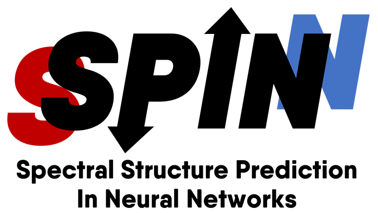

 

SSPINN is a software package meant to predict the structure of organic molecules based on experimentally obtained spectral data. Based on a user's input data, the SSPINN neural network will generate a connectivity matrix which predicts the bonding behavior between atoms in the user's molecule. This connectivity matrix will then be used to generate a graphical depiction of the predicted molecular structure. 

## Software Requirements
* All required software can be installed at the command line
 * `pip install -r requirements.txt`
    
## Installation Instructions
1. Clone git repository
 * `git clone https://github.com/awild82/SSPINN.git`
2. Install SSPINN at the command line
 * `python setup.py install --user`
    
## Structure Prediction
1. Format 13C data according to our [template](https://github.com/awild82/SSPINN/blob/master/docs/specs/nn_translator.md)
2. Save formatted data as `.txt`
3. In terminal, run `python -m sspinn <nmr file>`

## Testing
1. Open SSPINN directory in terminal
2. Navigate to `SSPINN/sspinn/test/`
2. Run `pytest`
 * If pytest is not already installed run `pip install pytest`
    
## Training
**Training a new model is for advanced users *only*.**
* For details on training new models, see [training.md](https://github.com/awild82/SSPINN/blob/master/docs/training.md)

## Contributing
1. Please help us improve our code by reporting any issues you encounter!
2. For developing on your own, SSPINN flow and style guidelines can be found [here](https://github.com/awild82/SSPINN/blob/master/docs/developing.md)
3. We are always looking to improve our programs prediction by expanding our training data set! If you would like to contribute data, please contact @awild82

## License Information
[MIT](https://github.com/awild82/SSPINN/blob/master/LICENSE)
