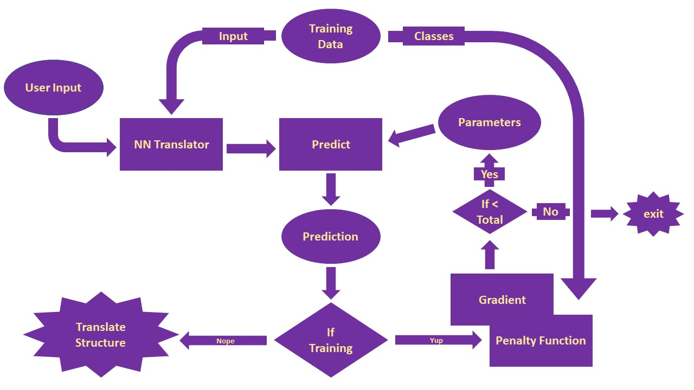

# Design

## Use Cases

1. Train a neural network to predict molecular structure from the empirical
   formula and NMR (and possibly other) spectral data
2. Use pre-trained neural networks to predict molecular structure from the
   empirical formula and NMR (and possibly other) spectral data
3. Visualization of molecular structure from connectivity matrix

## Components

### Component Diagram

### Component Details

0. Training Data
 * Data for training the neural network. Contains:
  * NMR and empirical formula data in the format expected from users
  * Molecular connectivity matrix
1. NN Translator
 * Takes NMR data and empirical formula in the following format: [insert format]
 * Returns data in the format expected as input for the neural net.
2. Predict
 * Takes the data from the NN Translator and decides to either feed it to a
	 pre-trained network or use it to train a new neural net.
 * Returns predictions for the input data.
 * If this is a training method, send output to the optimizer
 * If this is a predicting method, send output to the visualizer
3. Optimizer
 * Actually a part of the neural network.
 * Takes the predictions and descends the penalty surface
 * Returns a new set of parameters to feed back into the predictor. 
4. Translate structure
 * Takes the molecular connectivity matrix
 * Plots the 2D structure of the molecule
